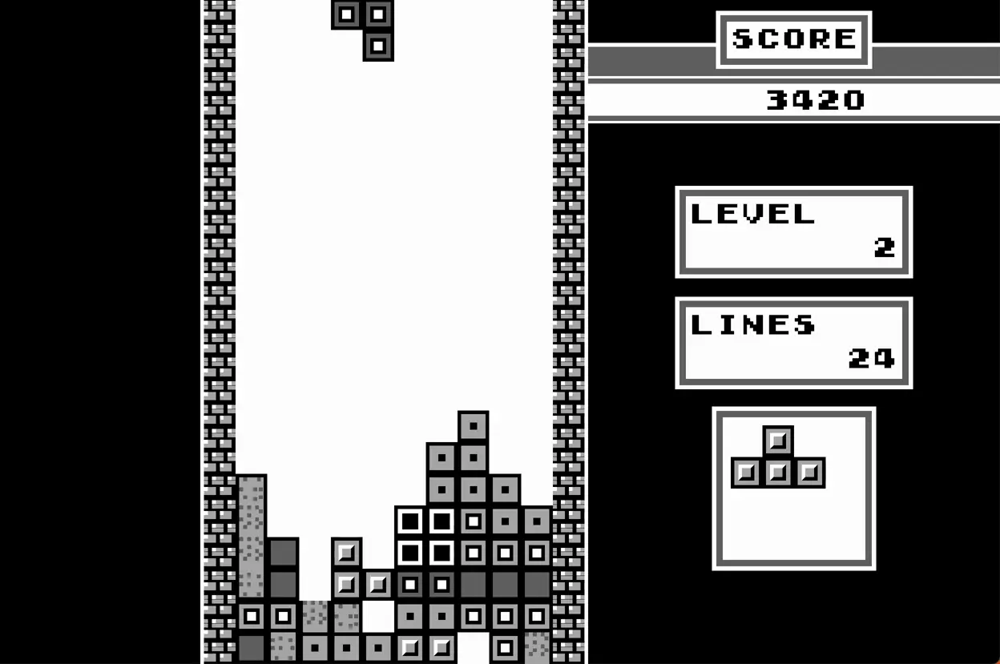

# HTML Tetris



This is not a serious implementation of tetris game, just a fun project
I wanted to do.

It's rotation system from NES Tetris game, so no _SRS_ or any other
advanced behaviour. The visuals were made to resemble the original
Gameboy release from 1989, no graphic sprites are used - just HTML
elements and CSS.

You should only run this game on modern browsers. Runtime requires
some browser APIs which might not be supported. There's no compilation
involved, just ESM modules.

The game can be installed if your operating system support PWA
(Progressive Web Application). It has the ability to run offline via Service worker support.

## Controls

By default you should use keyboard as an input device. `left`/`right`/`down` arrow
keys move the moving piece, `z`/`x`/`up` rotate it.
`F1`/`p` will pause the game.

## Browser support

The project wasn't made for older browsers and it actually requires modern
browser APIs to work properly, especially on iOS.

The game was developed on Firefox v105 and tested on Chrome v107 and
Safari 16.

## Development

The code doesn't have any build toolchain. You can use NodeJS for easier
development - there's a live server that can be launched with

`npm run dev`

which will open the game in "development" mode. You can enter this mode
by adding `?debug=1` to URL.

When focused in browser area, you can press `,` (comma) to print out
the state of playing area to console with TUI-style graphics. This log
doesn't contain moving piece, it's just a little helper for collision
detection.

You can also press `.` (dot) to print out context object which holds game
state.

### Service worker

The application is designed to run offline by leveraging service worker.
The setup is very naive as I'm trying to avoid any heavy build
toolchain. Whenever you add or remove any source or asset files, you should re-run `cache.sh` script from the project directory:

```
./scripts/cache.sh
```

This generates `cache.mjs` module which contains paths to all the source and asset files so they can be effectively cached.

## Test

`npm run test` runs a test suite. I only covered some parts of the code because
I intended to have fun.

## Deployment

Since the source code is using native ES modules, the deployment is as simple
as placing the contents of `src/` directory onto a web server.
